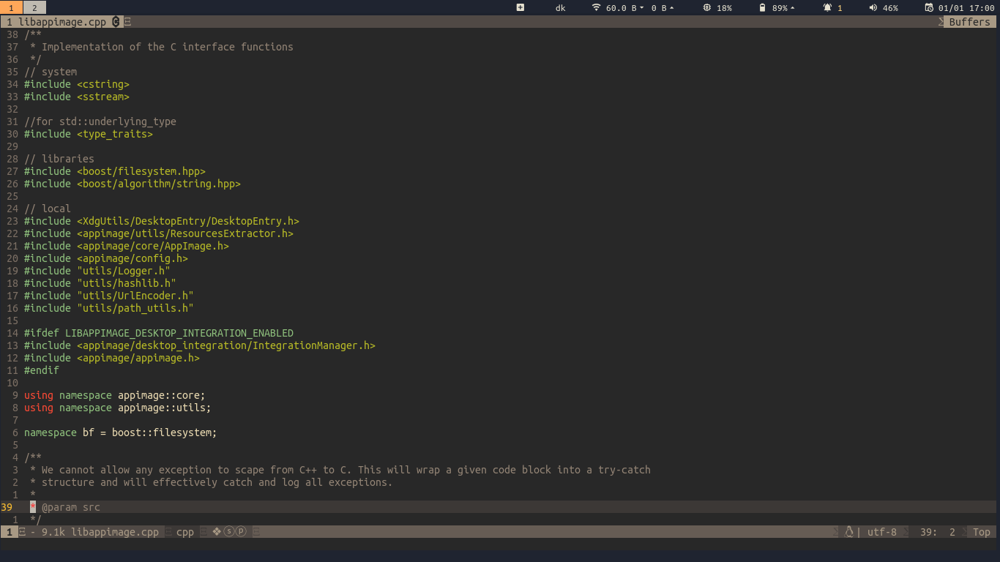

# Themes for Regolith

## What is Regolith?
[Regolith](https://regolith-linux.org/) is a desktop enviroment built on top of i3, which is a very popular tiling window manager. Tiling window managers are meant to be used with the keyboard, rather than the mouse, and they work by maximizing screen size usage. This means that the first application you run, fills up the entire screen. Subsequent windows get 1/2, 1/3 etc. And you can reorder things horizontally or vertically. I find myself to be more productive, because I don't need to move or resize windows.

Anyway, enough with the sales pitch...

## Current selection
*saemon* - slightly modified standard theme with a smaller fontsize. The text editor you see in the image is [SpaceVim](https://spacevim.org/)

